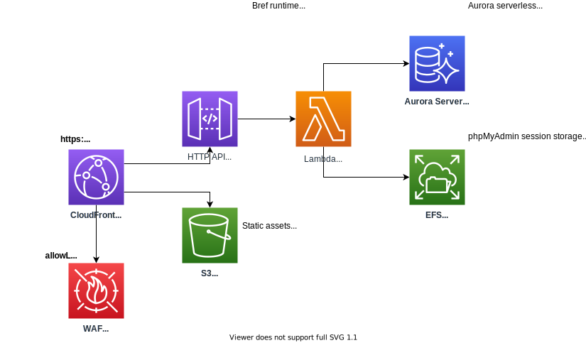

# cdk-serverless-phpmyadmin

Traditionally web hosting platforms offer an easy to use and convenient way to quickly visualize and manipulate data inside an MySQL database (typically via phpMyAdmin).  Unfortunately, Amazon RDS lacks this functionality at present.  Leveraging [cdk-serverless-php-mpa](https://github.com/aaronbrighton/cdk-serverless-php-mpa) this CDK app attempts to fill that gap by provisioning a serverless RDS database, and launching a serverless deployment of phpMyAdmin thanks in large-part due to the work done by the [Bref](https://bref.sh/) team to make running PHP on AWS Lambda a reality.

## Archictecture



## Requirements

- Docker
- Composer

## How to deploy

If you have any trouble following these instructions, please see [CDK Workshop](https://cdkworkshop.com/) for necessary background knowledge.

### Add your public IP address to the WAF whitelist

Due to the nature of phpMyAdmin and how it gives people with access to it the ability to directly login to your database, it's important to keep it locked down.  This deployment automatically enables an IP whitelist using AWS WAF.  You can add your IP to the whitelist by updating the following resource in `src/main.ts` (replace the existing IPs).

```
const cdn = new Cdn(this, 'ServerlessPhpMyAdminCdn', {
    code,
    waf: {
        allowListIpsV4: [
            '192.0.2.0/32',
        ],
    },
});
```

**Note:** if you have an IPv6 public IP you can whitelist it using the `allowListIpsV6` property in place of `allowListIpsV4`.

### Install node dependencies

```
yarn install
```

### Download and configure latest phpMyAdmin

Run the following command to download the latest phpMyAdmin release and automatically configure the config.inc.php.

```
yarn install-phpmyadmin
```

If it was successful, you should see a message like the following printed out:

```
phpMyAdmin config file (src/phpmyadmin/config.inc.php) has been configured...
```

### Deploy the CDK application

Using CDK provision the new serverless RDS database and associated serverless phpMyAdmin environment.

```
yarn deploy
```

If it was successful, you should see the following outputs (values may differ for you):

```
Outputs:
cdk-serverless-phpmyadmin.PhpMpaCdnEndpoint = https://d1fjico4uqgei2.cloudfront.net/
cdk-serverless-phpmyadmin.ServerlessPhpMyAdminDBCredentialsUserEndpoint = https://console.aws.amazon.com/secretsmanager/home?region=us-east-1#!/secret?name=ServerlessPhpMyAdminDatabas-ughDI2YjUf8R-tnd3Lr
```

The `PhpMpaCdnEndpoint` is the URL to access your deployed phpMyAdmin instance.  While the `ServerlessPhpMyAdminDBCredentialsUserEndpoint` is the URL to access the generated credentials for your provisioned serverless RDS database (you'll need these to login to phpMyAdmin).

## IMPORTANT: Note on costs

While this is technically a "serverless" deployment, there are some inconvenient realities that come into play when trying to support a traditional/legacy PHP application, therefore please be aware of the following (surprise) costs:

### PrivateLink

The underlying `cdk-serverless-php-mpa` CDK construct will create 2 AWS PrivateLink connections across 2 subnets for a total of 4 VPC endpoints.  This is necessary from a security stand-point so that if someone were to extract the AWS Lambda IAM role temporary credentials due to a vulnerability in phpMyAdmin (or even just a phpinfo file), they wouldn't be able to use that to access AWS secrets manager secrets or the EFS volume.

```
$0.01/hr/VPC interface endpoint
$0.01*4*730
= ~$29.2/mo
```

### WAF

The WAF that provides the IP whitelist for phpMyAdmin has some static monthly costs:

```
$5.00/WebACL/mo
$1.00/Rule/mo
$5.00+$1.00
= $6/mo
```

### Secrets Manager

The RDS database generates a user automatically and publishes that user's credentials to AWS Secrets Manager, where it is then consumed by the phpMyAdmin deployed Lambda function.  Secrets manager has some static costs as well:

```
$0.40/Secret/mo
= $0.40/mo
```

### Total estimated (idle) cost per month

:cry:, I'm open to suggestions on how to reduce costs, ideally without sacrificing *effecive* security.

```
~$29.2/mo VPC interface endpoints
$6/mo WAF WebACL & Rule
$0.40/mo Secrets Manager Secret
= $35.60
```